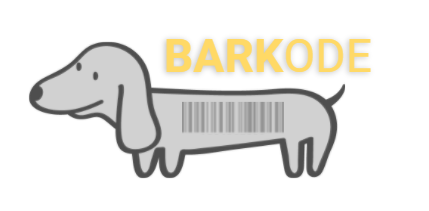

# Barkode
BMEG 357 Design Project

### Creators    
Hayley Moss, Eunice Nwaobi, Justin Cho, Shealie Lock, Ayush Bansal  
## What is it?   
Barkode is a venilator tracking solution that makes use of bardcodes and mobile scanning to automatically track the movement of ventilator units in the hospital. 

The project was commissioned by the Surrey Memorial team in search of reducing the workload of Respiratory Therapists, who perform manual duties of ventilatory tracking every morning.
